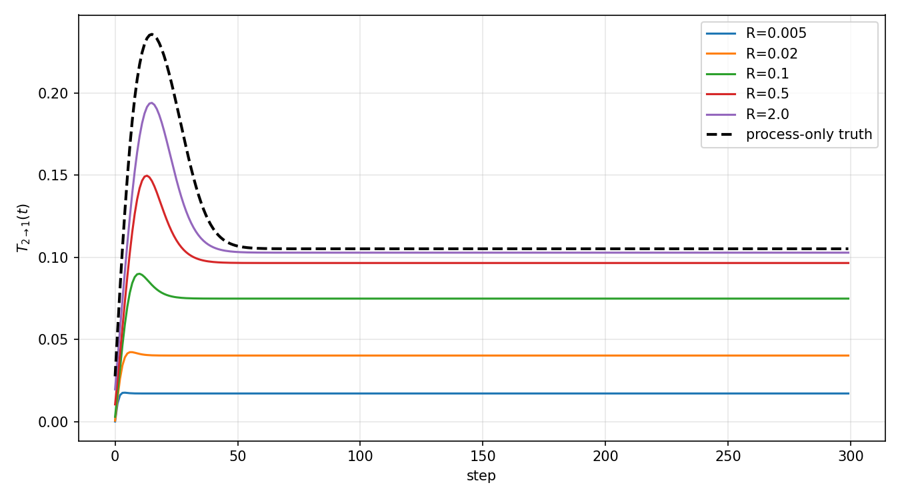
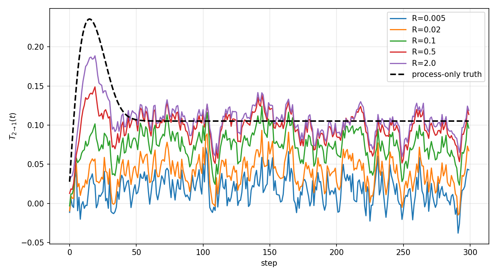

# IcyAlert Covariance Experiment

## Premise

Liang--Kleeman information transfer depends on the covariance structure of the system. This experiment tests what happens when the covariance supplied to the LK equation is the posterior covariance from data assimilation.

Two equivalent filters are compared:

- an Ensemble Kalman Filter (EnKF), where covariance is estimated across ensemble members;
- an analytical Kalman filter, where the covariance matrix is propagated directly.

Both use the same process model. The observation variance $R$ is varied to control how strongly the filters trust observations.

## Process model

The process model is

```math
dX_1=(a_{11}X_1+a_{12}X_2)\,dt+\sqrt{q}\,dW_1,
```

```math
dX_2=(a_{21}X_1+a_{22}X_2)\,dt+\sqrt{q}\,dW_2.
```

with $a_{11}=a_{22}=-1$, $a_{12}=0.5$, $a_{21}=0$ (information flows only $2\rightarrow1$), process-noise variance $q=0.01$, and $dt=0.1$.

## Observation model

```math
y_t=HX_t+v_t,\qquad H=I,\qquad v_t\sim\mathcal{N}(0,R\,I).
```

$X_t$ is the truth trajectory (the process model run once), and $R$ is the observation variance.

## Information transfer

For this system, information transfer from $X_2$ to $X_1$ is

```math
T_{2\rightarrow1}(t)
=a_{12}\frac{P_{12}(t)}{P_{11}(t)},
\qquad a_{12}=0.5.
```

The dashed curve in each figure is the process-only covariance reference, obtained without observation updates.

## Results

### Analytical Kalman filter



### Ensemble Kalman filter



Both methods behave the same: reducing $R$ contracts the posterior covariance and pushes $T_{2\rightarrow1}$ toward zero (the EnKF is noisier from finite-ensemble sampling). The posterior uncertainty covariance is a different object from the process covariance used by the reference LK calculation, and small observation noise compresses the structure that calculation needs.

## Run

```bash
python run_kalman_covariance.py
python run_enkf_covariance.py
```
